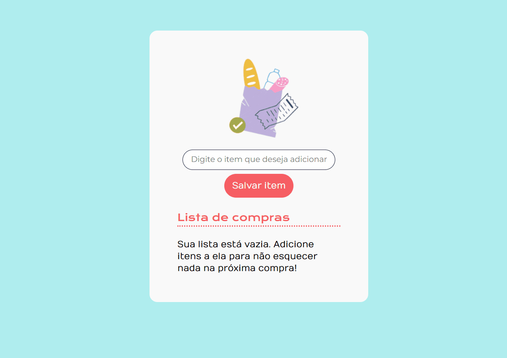

# 🛒 Lista de Compras

Aplicação web dinâmica desenvolvida como parte do curso **Construindo páginas dinâmicas com JavaScript**, da [Alura](https://www.alura.com.br/).  
Este projeto permite ao usuário criar, editar e gerenciar uma lista de compras de forma simples e interativa.

## ✨ Funcionalidades

- ✅ Adicionar itens com nome, data e hora de criação
- ✏️ Editar informações dos itens
- 🗑️ Excluir itens da lista
- 🛍️ Marcar itens como comprados utilizando checkboxes

## 💻 Tecnologias utilizadas

- **HTML**: Estruturação dos elementos da página  
- **CSS**: Estilização e responsividade da interface  
- **JavaScript**: Lógica para manipulação dinâmica da lista com DOM

## 📷 Demonstração



## 🚀 Como rodar o projeto

1. Clone este repositório:
   ```bash
   git clone https://github.com/amanda-berwig/Lista-de-compras.git


🚀 Como rodar o projeto
Clone este repositório:

bash
git clone https://github.com/seu-usuario/nome-do-repositorio.git

Abra o arquivo index.html em seu navegador.


